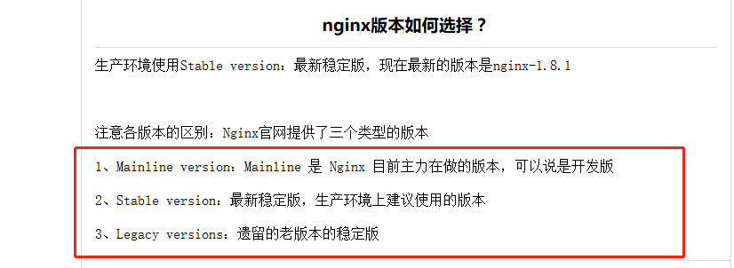
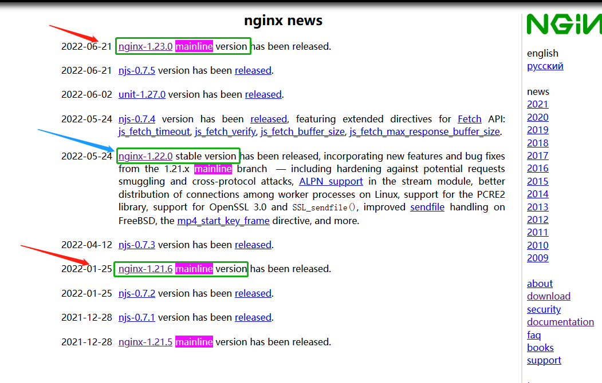

# 

- conf1, nginx 编译参数详解(运维不得不看) – 运维生存时间 http://www.ttlsa.com/nginx/nginx-configure-descriptions/
- conf2, nginx配置编译选项_netlai的博客-CSDN博客_nginx编译选项 https://blog.csdn.net/netlai/article/details/80016712
- Linux绿色版Nginx_怪人yo的博客-CSDN博客_nginx 绿色版 https://blog.csdn.net/weixin_43715518/article/details/122986204
- 缩小Nginx编译的体积 https://www.cainiao.io/archives/697

## vers

```bash
####### 1.21.6 mainline
3.19|upgraded to 1.21.6 #https://gitee.com/g-mids/build-nginx/blob/19cb42b4290b83e9bb6de2c6d13a126b5ae7f0b0/Dockerfile
4月4日 04:35|zlib to 1.2.12 #https://gitee.com/g-mids/build-nginx/commit/65fd92bc71515b8a7a8457e460011086b980d841
5月4日 08:27|openssl to 1.1.1o #https://gitee.com/g-mids/build-nginx/commit/04e5b1a46f48f5335b54429d2bc283f75b5d19aa
####### 1.23.0 mainline
6月23日 04:05|to 1.23.0 #https://gitee.com/g-mids/build-nginx/commit/7efcdc9345cf9a4107ca7a570aad1ae0a58a56b1
####### 1.22.0 stable
```





## mods

https://hub.fastgit.xyz/search?q=nginx+module&type=Repositories #2,816 repository results 

- arut/nginx-rtmp-module 12k
- openresty/lua-nginx-module 10k
- winshining/nginx-http-flv-module 2.2k
- vozlt/nginx-module-vts 2.7k
- kaltura/nginx-vod-module 1.6k
- yaoweibin/nginx_tcp_proxy_module 1.6k
- wandenberg/nginx-push-stream-module 2.1k
- 
- vouch/vouch-proxy #SSO and OAuth / OIDC login solution for Nginx using the auth_request module
- loveshell/ngx_lua_waf 基于lua-nginx-module(openresty)的web应用防火墙 
- alexazhou/VeryNginx base on lua-nginx-module( openresty ) which provide WAF, Control Panel, 
- ADD-SP/ngx_waf #Nginx firewall module & 方便、高性能、兼容 ModSecurity 的 Nginx 防火墙模块 

## old1

```bash
[root@5c53533b458e rootfs]# cd bin/
[root@5c53533b458e bin]# ./nginx -V
nginx version: nginx/1.23.0
built by gcc 10.2.1 20201203 (Alpine 10.2.1_pre1) 
built with OpenSSL 1.1.1o  3 May 2022
TLS SNI support enabled
configure arguments: --with-cc-opt=-static --with-ld-opt=-static --with-cpu-opt=generic --sbin-path=/bin/nginx --conf-path=/etc/nginx/nginx.conf --pid-path=/tmp/nginx.pid --http-log-path=/dev/stdout --error-log-path=/dev/stderr --http-client-body-temp-path=/tmp/client_temp --http-fastcgi-temp-path=/tmp/fastcgi_temp --http-proxy-temp-path=/tmp/proxy_temp --http-scgi-temp-path=/tmp/scgi_temp --http-uwsgi-temp-path=/tmp/uwsgi_temp --with-select_module --with-poll_module --with-threads --with-file-aio --with-http_ssl_module --with-http_v2_module --with-http_realip_module --with-http_addition_module --with-http_sub_module --with-http_dav_module --with-http_flv_module --with-http_mp4_module --with-http_gunzip_module --with-http_gzip_static_module --with-http_auth_request_module --with-http_random_index_module --with-http_secure_link_module --with-http_degradation_module --with-http_slice_module --with-http_stub_status_module --with-mail --with-mail_ssl_module --with-stream --with-stream_ssl_module --with-stream_realip_module --with-stream_ssl_preread_module --with-compat --with-openssl=/tmp/openssl-1.1.1o --with-zlib=/tmp/zlib-1.2.12
[root@5c53533b458e bin]# cd ..
[root@5c53533b458e rootfs]# find
.
./bin
./bin/nginx
./etc
./etc/group
./etc/nginx
./etc/passwd
./etc/ssl
./etc/ssl/certs
./etc/ssl/certs/ca-certificates.crt
./tmp
[root@5c53533b458e rootfs]#
```

## relativePath Compile (1.23.0)

```bash
[root@5de44215a034 sbin]# ./nginx  -V
nginx version: nginx/1.23.0
built by gcc 10.2.1 20201203 (Alpine 10.2.1_pre1) 
built with OpenSSL 1.1.1o  3 May 2022
TLS SNI support enabled
configure arguments: --with-cc-opt=-static --with-ld-opt=-static --with-cpu-opt=generic --prefix=../../nginx --http-client-body-temp-path=./temp/client_temp --http-fastcgi-temp-path=./temp/fastcgi_temp --http-proxy-temp-path=./temp/proxy_temp --http-scgi-temp-path=./temp/scgi_temp --http-uwsgi-temp-path=./temp/uwsgi_temp --with-select_module --with-poll_module --with-threads --with-file-aio --with-http_ssl_module --with-http_v2_module --with-http_realip_module --with-http_addition_module --with-http_sub_module --with-http_dav_module --with-http_flv_module --with-http_mp4_module --with-http_gunzip_module --with-http_gzip_static_module --with-http_auth_request_module --with-http_random_index_module --with-http_secure_link_module --with-http_degradation_module --with-http_slice_module --with-http_stub_status_module --with-mail --with-mail_ssl_module --with-stream --with-stream_ssl_module --with-stream_realip_module --with-stream_ssl_preread_module --with-compat --with-openssl=/tmp/openssl-1.1.1o --with-zlib=/tmp/zlib-1.2.12

[root@5de44215a034 nginx]# tree
.
├── conf
│   ├── html
│   │   ├── 50x.html
│   │   └── index.html
│   ├── mime.types
│   └── nginx.conf
├── html
├── logs
│   ├── access.log
│   ├── error.log
│   └── nginx.pid
├── sbin
│   └── nginx
└── temp
    ├── client_temp
    ├── fastcgi_temp
    ├── proxy_temp
    ├── scgi_temp
    └── uwsgi_temp

11 directories, 8 files
```

- 缩小Nginx编译的体积 https://www.cainiao.io/archives/697

```bash
      # https://blog.51cto.com/65147718/1858474?utm_source=debugrun
      # #CFLAGS=”$CFLAGS -g” (注释掉这行,去掉 debug 模式编译,编译以后程序只有几百 k)
      # https://www.cainiao.io/archives/697
      # cat auto/cc/gcc |grep CFLAGS; \
      sed -i "s^CFLAGS\=\"\$CFLAGS\ \-g\"^#CFLAGS=\"\$CFLAGS \-g\"^g" auto/cc/gcc; \
[root@81b2c8ed8fa7 sbin]# ls -lh
total 13M
-rwxr-xr-x 1 10000 10000 13M Jul 15 18:51 nginx

[root@3beb3a55da2a sbin]# ls -lh
total 5.9M #static size;
-rwxr-xr-x 1 10000 10000 5.9M Jul 15 20:08 nginx
```

## stableVersion (1.22.0)

```bash
[root@6c055e6100f3 sbin]# ls -lh
total 5.9M
-rwxr-xr-x 1 10000 10000 5.9M Jul 15 21:30 nginx

[root@6c055e6100f3 sbin]# ./nginx  -V
nginx version: nginx/1.22.0
built by gcc 10.2.1 20201203 (Alpine 10.2.1_pre1) 
built with OpenSSL 1.1.1o  3 May 2022
TLS SNI support enabled
configure arguments: --with-cc-opt=-static --with-ld-opt=-static --with-cpu-opt=generic --prefix=../../nginx --http-client-body-temp-path=./temp/client_temp --http-fastcgi-temp-path=./temp/fastcgi_temp --http-proxy-temp-path=./temp/proxy_temp --http-scgi-temp-path=./temp/scgi_temp --http-uwsgi-temp-path=./temp/uwsgi_temp --with-select_module --with-poll_module --with-threads --with-file-aio --with-http_ssl_module --with-http_v2_module --with-http_realip_module --with-http_addition_module --with-http_sub_module --with-http_dav_module --with-http_flv_module --with-http_mp4_module --with-http_gunzip_module --with-http_gzip_static_module --with-http_auth_request_module --with-http_random_index_module --with-http_secure_link_module --with-http_degradation_module --with-http_slice_module --with-http_stub_status_module --with-mail --with-mail_ssl_module --with-stream --with-stream_ssl_module --with-stream_realip_module --with-stream_ssl_preread_module --with-compat --with-openssl=/tmp/openssl-1.1.1o --with-zlib=/tmp/zlib-1.2.12
```